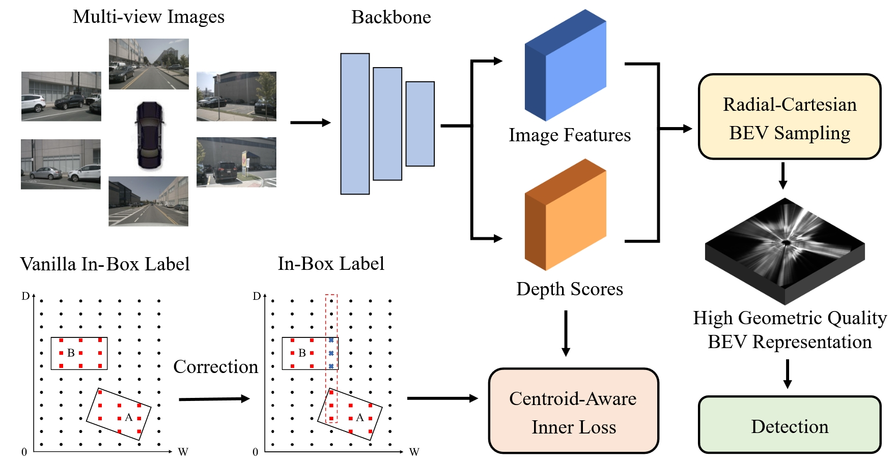

<div align="center">
<h1>GeoBEV</h1>
<h3>[AAAI2025] GeoBEV: Learning Geometric BEV Representation for Multi-view 3D Object Detection</h3>
</div>


<div align="center">
  
</div><br/>

## News

- GeoBEV is accepted by AAAI 2025. The paper is available at [arxiv](https://arxiv.org/abs/2409.01816).

## Main Results

| Config                                                          | mAP   | NDS  | Download |
| --------------------------------------------------------------- | :----: | :----: | :---: |
| [**GeoBEV-R50-nuImage-CBGS**](configs/geobev/geobev-r50-nuimage-cbgs.py)     | 0.430  | 0.546 | [model](https://drive.google.com/drive/folders/1VcWBwf_mjrCLTQazl7QdS6AGjnW6ALaA?usp=sharing) |
| [**GeoBEV-R50-nuImage-CBGS-Longterm**](configs/geobev/geobev-r50-nuimage-cbgs-longterm.py)  | 0.479  | 0.575 | [model](https://drive.google.com/drive/folders/1VcWBwf_mjrCLTQazl7QdS6AGjnW6ALaA?usp=sharing) |
| [**GeoBEV-R101-nuImage-CBGS-Longterm**](configs/geobev/geobev-r101-nuimage-cbgs-longterm.py)| 0.526  | 0.615 | [model](https://drive.google.com/drive/folders/1VcWBwf_mjrCLTQazl7QdS6AGjnW6ALaA?usp=sharing) |


## Get Started

#### 1. Please follow these steps to install SA-BEV.

a. Create a conda virtual environment and activate it.
```shell
conda create -n geobev python=3.8 -y
conda activate geobev
```

b. Install PyTorch and torchvision following the [official instructions](https://pytorch.org/).
```shell
pip install torch==1.10.0+cu111 torchvision==0.11.0+cu111 torchaudio==0.10.0 -f https://download.pytorch.org/whl/torch_stable.html
```

c. Install GeoBEV as mmdet3d.
```shell
pip install mmcv-full==1.5.3
pip install mmdet==2.27.0
pip install mmsegmentation==0.25.0
pip install -e .
```

#### 2. Prepare nuScenes dataset as the below folder structure:

```
GeoBEV
├── data
│   ├── nuscenes
│   │   ├── lidarseg
│   │   ├── maps
│   │   ├── samples
│   │   ├── samples_instance_mask
│   │   ├── samples_point_label
│   │   ├── sweeps
│   │   ├── v1.0-test
|   |   ├── v1.0-trainval
│   │   ├── geobev-nuscenes_infos_train.pkl
│   │   ├── geobev-nuscenes_infos_val.pkl
```
a. Download nuScenes 3D detection data [HERE](https://www.nuscenes.org/download) and unzip all zip files.


b. The fold `samples_instance_mask`  includes the instance masks of nuScenes images, which are predicted by the [HTC model](configs/nuimages/htc_x101_64x4d_fpn_dconv_c3-c5_coco-20e_16x1_20e_nuim.py) pretrained on nuImages dataset. The prepared data can be downloaded [HERE](https://drive.google.com/drive/folders/1VcWBwf_mjrCLTQazl7QdS6AGjnW6ALaA?usp=sharing).

c. Create the pkl for GeoBEV by running
```shell
python tools/create_data_bevdet.py
```

d. Download nuScenes-lidarseg annotations [HERE](https://www.nuscenes.org/download) and put it under `GeoBEV/data/nuscenes/`. Create depth and semantic labels from point cloud by running:
```shell
python tools/generate_point_label.py
```

#### 3. Train GeoBEV model on nuScenes:
Download the backbones pretrained on nuImages dataset [HERE](https://drive.google.com/drive/folders/1VcWBwf_mjrCLTQazl7QdS6AGjnW6ALaA?usp=sharing) and put them under `GeoBEV/ckpts`. Then train the GeoBEV model following:
```shell
bash tools/dist_train.sh configs/geobev/geobev-r50-nuimage-cbgs.py 8
```
#### 4. Evaluate GeoBEV model following:
```shell
bash tools/dist_test.sh configs/geobev/geobev-r50-nuimage-cbgs.py work_dirs/geobev-r50-nuimage-cbgs/epoch_20_ema.pth 8 --eval bbox
```
## Acknowledgement

This project is not possible without multiple great open-sourced code bases. We list some notable examples below.

- [BEVDet](https://github.com/HuangJunJie2017/BEVDet)
- [BEVDepth](https://github.com/Megvii-BaseDetection/BEVDepth)
- [open-mmlab](https://github.com/open-mmlab)
- [CenterPoint](https://github.com/tianweiy/CenterPoint)
- [Lift-Splat-Shoot](https://github.com/nv-tlabs/lift-splat-shoot)

## Bibtex

If GeoBEV is helpful for your research, please consider citing the following BibTeX entry.
```
@article{zhang2024geobev,
  title={Geobev: Learning geometric bev representation for multi-view 3d object detection},
  author={Zhang, Jinqing and Zhang, Yanan and Qi, Yunlong and Fu, Zehua and Liu, Qingjie and Wang, Yunhong},
  journal={arXiv preprint arXiv:2409.01816},
  year={2024}
}
```